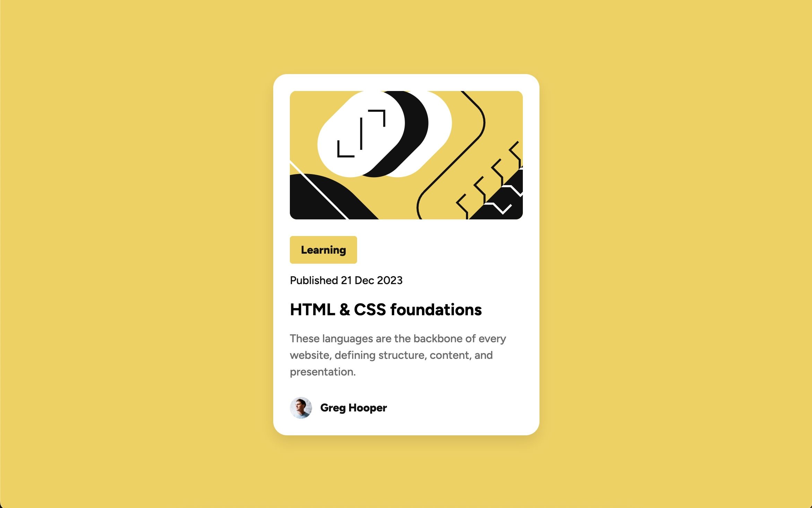

# Frontend Mentor - Blog preview card solution

This is a solution to the [Blog preview card challenge on Frontend Mentor](https://www.frontendmentor.io/challenges/blog-preview-card-ckPaj01IcS). Frontend Mentor challenges help you improve your coding skills by building realistic projects. 

## Table of contents

- [Overview](#overview)
  - [The challenge](#the-challenge)
  - [Screenshot](#screenshot)
  - [Links](#links)
- [My process](#my-process)
  - [Built with](#built-with)
  - [What I learned](#what-i-learned)
  - [Continued development](#continued-development)
- [Author](#author)

## Overview

### The challenge

Users should be able to:

- See hover and focus states for all interactive elements on the page

### Screenshot



### Links

- Solution URL: [Add solution URL here](https://your-solution-url.com)
- Live Site URL: [Add live site URL here](https://mwinn616.github.io/blog-preview-card-main/)

## My process

### Built with

- Semantic HTML5 markup
- CSS custom properties
- Flexbox
- Mobile-first workflow

### What I learned

This activity was great to practice re-sizing text elements for mobile view. Here is a snippet of the CSS I used for the text elements on the card:


```css
@media (max-width: 375px) {
    
 h2 {
        font-size: 1.25rem;
    }

    .description {
        font-size: 0.875rem;
    }

    .date, .label {
        font-size: 0.75rem;
    }
```

### Continued development

I want to focus in on the best way to style text elements. I used a mix of classes and semantic elements (such as h2) and curious what the best method is.

## Author

- Github - [Mark Winn](https://github.com/mwinn616)
- LinkedIn - [@markawinn](https://www.linkedin.com/in/markawinn/)
- Frontend Mentor - [@mwinn616](https://www.frontendmentor.io/profile/mwinn616)
